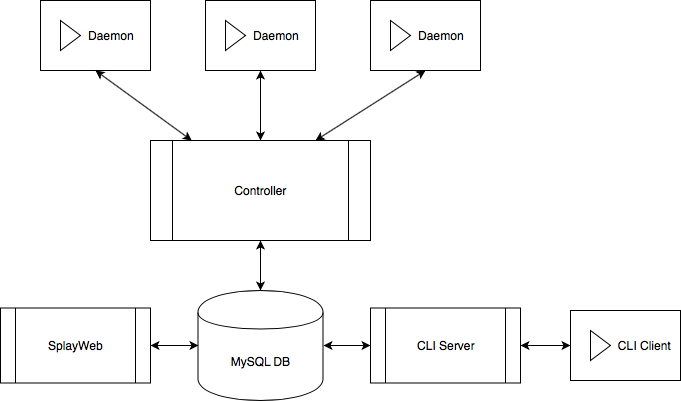

# SPLAY 
This is the official github repository of the Splay project.

## Overview
SPLAY simplifies the prototyping and development of large-scale distributed applications and overlay networks. SPLAY covers the complete chain of distributed system design, development and testing: from coding and local runs to controlled deployment, experiment control and monitoring.
SPLAY allows developers to specify their distributed applications in a concise way using a specialized language based on Lua, a highly-efficient embeddable scripting language. SPLAY applications execute in a safe environment with restricted access to local resources (file system, network, memory) and can be instantiated on a large variety of testbeds composed a large set of nodes with a single command.
SPLAY is the outcome of research and development activities at the [Computer Science Department](http://www2.unine.ch/iiun) of the University of Neuchatel.

## Getting started
The source code of SPLAY is available under the General Public License (GPLv3) and published through this repository.

The main research paper that describes SPLAY, evaluates its performances and presents several typical experiments has been published in the proceedings of the 6th USENIX Symposium on Networked Systems Design and Implementation (NSDI'09).

SplayNet implements topology emulation features for SPLAY. It has been published in the Proceedings of the 14th ACM/IFIP/USENIX International Middleware Conference (MIDDLEWARE'13). 

The SPLAY NSDI'09 paper is available as a [web page](https://www.usenix.org/legacy/event/nsdi09/tech/full_papers/leonini/leonini_html/) or as a [PDF](http://members.unine.ch/etienne.riviere/publications/LeoRivFel-NSDI-09.pdf).

The SplayNet MIDDLEWARE'13 is available as [PDF](http://members.unine.ch/valerio.schiavoni/publications/splaynet_middleware13.pdf).

# Update By Monroe Samuel && Voet Rémy (UCL)

- We have upgrade the version :
    - of ruby for splayweb and the controller from 1.8.6 to 2.5.1 .
    - of lua for the daemon and the rpc_client from 5.1 to 5.3 .
    - of rails for splayweb form 2.1.0 to 5.2.0

## Current Model

There 6 main parts : daemon, controller, Db (MySql5.5), cli_server, cli_client and splayweb.




## HOW TO LAUNCH

The 5 part are dockerized (need Docker), to build containers, run : `docker-compose build`
When build finish, you can launch every mandatory part :
```
docker-compose up -d cli_server
docker-compose up -d splayweb
```
Then you can launch some daemon which accept jobs later : `docker-compose scale daemon=5`

To submit job, you can use the splayweb (not finish) or use cli_client contenaire :
`docker run -it splay_terminal`
and you can now excecute some lua scripts on this terminal.

To tests the all stuff run `test_cyclon.sh` (Will kill/remove all your docker images)

## Improve TODO

- Allow job creation on SplayWeb
SplayWeb doesn't implement all the features present on the old website.
- CSS and JavaScript on SplayWeb 
- Some useful changes might have been done on the Splayd Controller, 
and weren't applied on our rework and update as we started 
everything again from 
some last commit in 2011. Therefore, some things might 
be missing and we encounter now and then little bugs such as a 
Daemon being refused by the Controller. 
- Unify the user management, the way it is done now isn't 
very secure and really cumbersome to work with in Rails. (see Devise)


## Major change Idea

During our rework on the whole Splay project, we thought about what was pleasant 
and what was more unpleasant to us, and therefore imagined some ways 
to transform this project using different architecture or technologies.

### Lessen the DB usage 

The fact that the DB is used as the main communication component feels 
wrong, the Controller polling constantly the DB with `SELECT` on the 
job table appear to us like something that shouldn't be done.

Maybe the CLIServer and SplayWeb should talk directly with the Controller 
instead of just writing things on it. Of course it might still use the 
DB for data retrieving. 

### Merge cli_server and splayweb

The SplayWeb is in fact redoing exactly what CLIServer is offering to CLIClient, 
unifying the two of them by providing a JSON API within SplayWeb, besides the 
front-end application, would avoid code duplication and centralize the logic. 

### Usage of Erlang/Elixir

Maybe some parts of the project could be rewritten using Elixir, which is 
very adapted for building distributed application and provide easy-to-use 
libraries for communication.